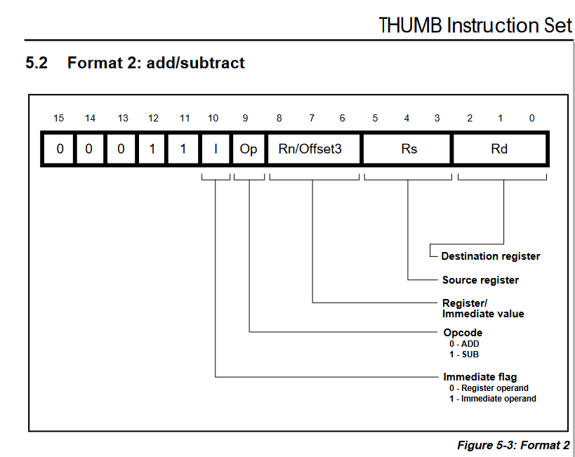
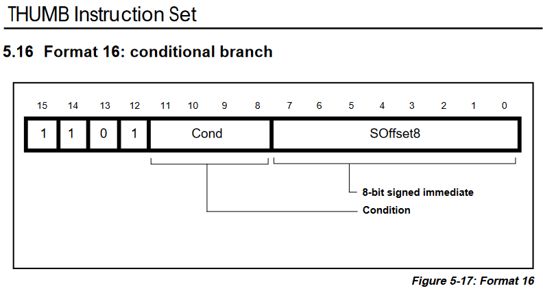

# ARO laboratoire 2 DECODE

## Questions

### Question 1
```

```

### Question 2
```
Sur la sortie rn_8_6_o.
```


### Question 3
```
Pour la condition c'est la sortie cond_11_8_o.

Pour l'offset c'est la sortie offset8_7_0_o.
```


### Question 4
```
Les 4 instructions travaillant uniquement avec des registres ont un opcode de 7 bits.

Les instructions employant un offset immédiat utilisent des opcodes à 5 bits.
```

## Etape 5.2
```

```

## Tableaux (pas besoin je crois mais c'est demandé de les complèter)

### Etape 2.5
|Instruction  |sel_cpsr|link_en|sel_PC|cond_en|
|-------------|--------|-------|------|-------|
|add_r_r_r_s  |1       |0      |0     |0      |
|add_r_r_imm_s|1       |0      |0     |0      |
|ldrb_r_r_r_s |0       |0      |0     |0      |

### Etape 2.6
|Instruction  |sel_rs(0)|sel_rs(1)|sel_rn|sel_rd|
|-------------|---------|---------|------|------|
|add_r_r_imm_s|0        |0        |0     |0     |
|mov_r_imm_s  |1        |0        |0     |1     |
|ror_r_r_s    |1        |0        |1     |0     |

### Etape 2.7
|Instruction  |reg_bank_wr|
|-------------|-----------|
|lsl_r_r_imm_s|1          |
|eor_r_r_s    |1          |
|strh_r_r_r_s |0          |